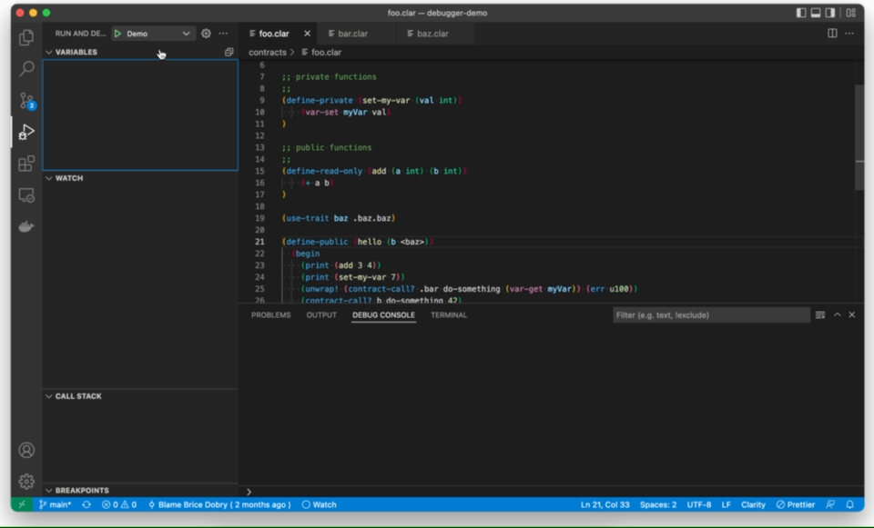
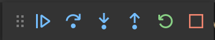
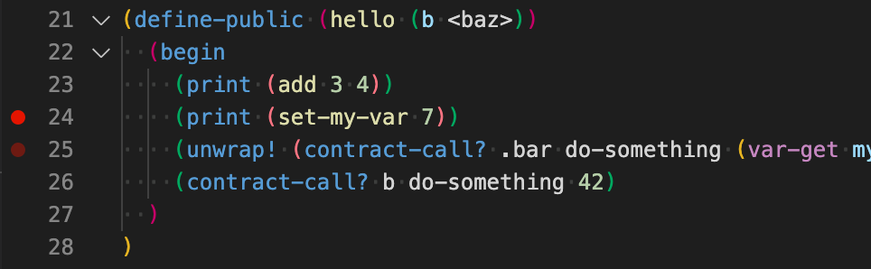
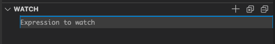
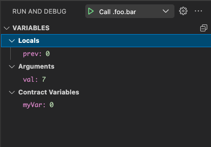
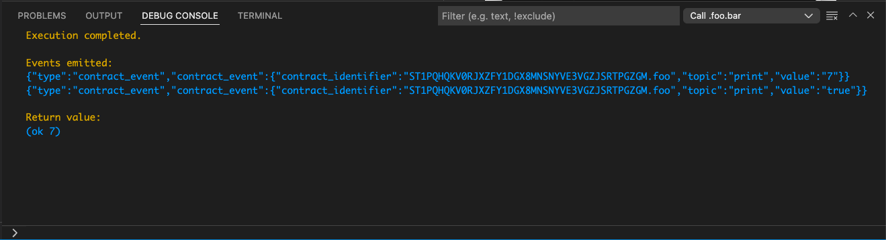

# Clarinet Debugger Demo

This simple project is used to demonstrate the features of the debuggers enabled by [clarinet](https://github.com/hirosystems/clarinet).

## Visual Studio Code Debugger



Clarinet implements the [Debug Adapter Protocol (DAP)](https://microsoft.github.io/debug-adapter-protocol/), a protocol defined by Microsoft to enable a standard interface for IDEs and other tools to interact with debuggers.

### Debug configuration

To setup a debug session, you'll first need to define a debug configuration. In the Run and Debug sidebar, you will see a link to "create a launch.json file." Clicking that will generate a default configuration at _.vscode/launch.json_.

```json
{
  // Use IntelliSense to learn about possible attributes.
  // Hover to view descriptions of existing attributes.
  // For more information, visit: https://go.microsoft.com/fwlink/?linkid=830387
  "version": "0.2.0",
  "configurations": [
    {
      "type": "clarinet",
      "request": "launch",
      "name": "Example Title",
      "manifest": "${workspaceFolder}/Clarinet.toml",
      "expression": "(contract-call? .foo hello .bar)"
    }
  ]
}
```

- `type`: should always be set to `clarinet` for debugging Clarity smart contracts.
- `request`: should always be set to `launch`.
- `name`: any name used to identify your debug configuration (you may define multiple), and will be used to select the configuration from the dropdown.
- `manifest`: path to the _Clarinet.toml_ file
- `expression`: Clarity expression to be debugged

### Starting a debug session

After the configuration has been defined, click the ▶️ button to begin execution. The expression defined in the configuration will begin to execute and execution will pause at the start.

### Control execution

When the debug session is started, you should see the debug command buttons at the top of the editor panel:



In order, these buttons are:

- **Continue**: continue execution until hitting a breakpoint or completion
- **Step Over**: step over the current expression, to the next
- **Step In**: step into the sub-expressions of the current expression, or into a called function, including across contracts through a `contract-call?`
- **Step Out**: step out of the current expression, back to the parent expression (including stepping out of a function)
- **Restart**: restart the debug session
- **Stop**: stop the current debug session

### Setting breakpoints

In the editor, mouse over the left-side gutter of your Clarity file and click the red circle to add a breakpoint.



You can also use the "Inline Breakpoint" menu item to add a breakpoint at the cursor position, to break at a specific column number.

### Setting data breakpoints / watchpoints

A data breakpoint (or watchpoint) tells the debugger to stop when the value of a specific contract variable will change. This can be useful when you need to figure out how a specific value is getting changed from a certain interaction.

To add a data breakpoint, click the "+" in the "WATCH" section of the "Run and Debug" sidebar.



Then, in the "Expression to watch" text box that opens up, specify the object to watch in the format `<principal>.<contract>.<name>`, for example:

```
ST1PQHQKV0RJXZFY1DGX8MNSNYVE3VGZJSRTPGZGM.bar.myVar
```

If the principal is the same as the current `tx-sender`, the principal can be omitted, just like in Clarity:

```
.bar.myVar
```

When the program is executing, the current value of this object will be shown next to it, and will automatically update as execution continues.

### Variables

You may have noticed that at the top of the "Run and Debug" sidebar, there is a panel titled "VARIABLES". In this panel, during execution, you will see the current value of variables in the current context. This includes contract variables, function arguments, and local `let`-bindings.



### Call stack

Below the "WATCH" panel of the "Run and Debug" sidebar, you will find the "CALL STACK" panel. This panel shows the call stack that led to the current execution point. Clicking on different levels in the stack updates the editor to show the call and also updates the variable panel to show the variables at that context.


### Evaluating expressions

During a debug session, the Debug Console (see View menu) can be used to evaluate any Clarity expression. Just type the Clarity expression at the prompt in the Debug Console and it is evaluated in the current context, including access to arguments and local `let`-bindings.

### Completing execution

When the execution completes, check the Debug Console for events emitted by the execution, and the final return value.



---

## Command Line Debugger


View a video walkthrough of the command line debugger at https://youtu.be/nVDWeuMnkDs.

### Starting a debug session

The command line debugger is built inside of the console, so start off in your project directory and run:

```sh
clarinet console
```

Inside of the console, use the command `::debug <expr>` to start an interactive debugging session executing `<expr>`.

```
::debug (contract-call? .foo hello .bar)
```

This will bring you into the debug session:


Execution is stopped at the first expression, `begin` in this case, and the source code is shown in context. If the expression in the debug command includes subexpressions, then those will be debugged as well.

### Setting a function breakpoint

Now, let's set a breakpoint to pause execution when we reach the `add` function of the contract `foo`:

```
break ST1PQHQKV0RJXZFY1DGX8MNSNYVE3VGZJSRTPGZGM.foo.add
```

To simplify that, we can shorten `break` to just `b`, and drop the principal, since it is the same principal as the current `tx-sender`:

```
b .foo.add
```

Since we are already in the `foo` contract, this can be simplified even further to just:

```
b add
```

Now, we can run `break list` or `b l` to see the list of current breakpoints:

```
b l
```

If you followed all of the above steps, you'll see three breakpoints on the same function. We can delete two of those to avoid confusion:

```
b del 2
b del 3
```

### Continue to the next breakpoint

Now that we've set a breakpoint, we can use the `continue` or `c` command to continue execution until a breakpoint is hit:

```
c
```

You should find that you've hit the breakpoint and are now paused inside of `.foo.add`.

### Printing expressions

When stopped at a breakpoint, it will be useful to figure out the current values of various variables and expressions. We can do that using the `print` or `p` command followed by an expression. In our example, we might want to see the value of the parameter `a`:

```
p a
```

But it is not limited just to variable names, we can also evaluate an expression:

```
p (+ a b)
```

### Stepping out of an expression

After examining `a` and `b`, we may want to finish executing `add` and return to the caller. To do that, use `finish` or `f`:

```
finish
```

The value returned from the current expression is printed, and execution returns to the outer expression. In this case, we finish with `add`, return back to `hello`, and see the return value of 7, as expected.

### Setting a watchpoint

Now, let's look at a different kind of breakpoint: a watchpoint or also referred to as a data breakpoint. This is useful when you want to pause execution when a specific variable (or map) is accessed. To break on write, use `watch` or `w`, followed by the data to watch:

```
watch ST1PQHQKV0RJXZFY1DGX8MNSNYVE3VGZJSRTPGZGM.foo.myVar
```

Similar to breakpoints, since the object we want to watch is in the same contract that we are currently paused in, this command can be simplified to:

```
w .foo.myVar
```

Or:

```
w myVar
```

This default watchpoint will break when the specified object is written. Alternatively, you can also use `rwatch` or `rw` to break on read, and `awatch` or `aw` to break on read or write.

Now that our watchpoint is set, let's continue:

```
c
```

You should see that execution has stopped at `(var-set myVar val)`.

### Setting a source breakpoint

There's one more way to set a breakpoint, and that is by specifying a line number (and optionally column number). Let's stop inside of the `do-something` function in the `bar` contract. As seen above, we could use `b .bar.do-something`, but this time, we'll use a different syntax to break based on the source position:

```
break ST1PQHQKV0RJXZFY1DGX8MNSNYVE3VGZJSRTPGZGM.bar:18
```

This says to break at line 18 of the `bar` contract deployed by `ST1PQHQKV0RJXZFY1DGX8MNSNYVE3VGZJSRTPGZGM`. As before, since the current `tx-sender` is the same as the deployer, we can simplify the command to:

```
b .bar:18
```

If we wanted to be more specific, we could also specify a column number:

```
b .bar:18:5
```

If we wanted to set a breakpoint in the current contract (`foo`), then the contract specifier can be left out altogether:

```
b :27
```

That means break at line 27 of the current contract.

Now, let's delete some of those breakpoints we were experimenting with, so we are just left with the one on `bar` line 18, then continue our execution:

```
b del 1
b del 6
b del 7
b del 8
c
```

### Stepping into an expression

If all went well so far, you should now find yourself sitting at line 12 of the `bar` contract, at the beginning of the `let` expression. We want to explore the subexpressions here, so let's use a new command, `step` or `s`:

```
s
```

Stepping in once will take us to the `var-get` initializing the let-binding variable, `prev`. Stepping again will jump to the next subexpression, since `(var-get myVar)` has no further sub-expressions of its own, leaving us at line 19, `(var-set myVar (max10 val))`.

### Stepping over an expression

As discussed above, the `step` command enters into the subexpressions. On line 19, if we do that, we will enter into the `max10` function. This time, we want to step over the subexpressions, and just proceed to the next expression at this level, `(ok prev)` on line 20 in this case. To do that, we use the `next` or `n` command:

```
n
```

### Dynamic contract calls (through `trait`)

We've now covered all of the available commands in the debugger. One last thing to show is that the breakpoints will work as expected, even when reached through a dynamic contract call, via a trait. Let's delete all existing breakpoints and watchpoints, then add a new breakpoint on `.bar.do-something`:

```
b del
w del
b .bar.do-something
```

Now, let's continue execution and verify that this breakpoint is hit, due to the dynamic contract call from `foo`, line 27, `(contract-call? b do-something 42)`.

```
c
```

Now you should be paused at `bar`, line 12 again. Let's print `val` and verify that it is `42 as expected.

```
p val
```

### Finishing up

We've now covered all of the important details of the new smart contract debugger! Running the continue command once more will finish the rest of the execution, and you will see the emitted events, then return to the console. Play with it on your own and [submit issues](https://github.com/hirosystems/clarity-repl/issues/new/choose) for any bugs you find or enhancements that would be helpful!
